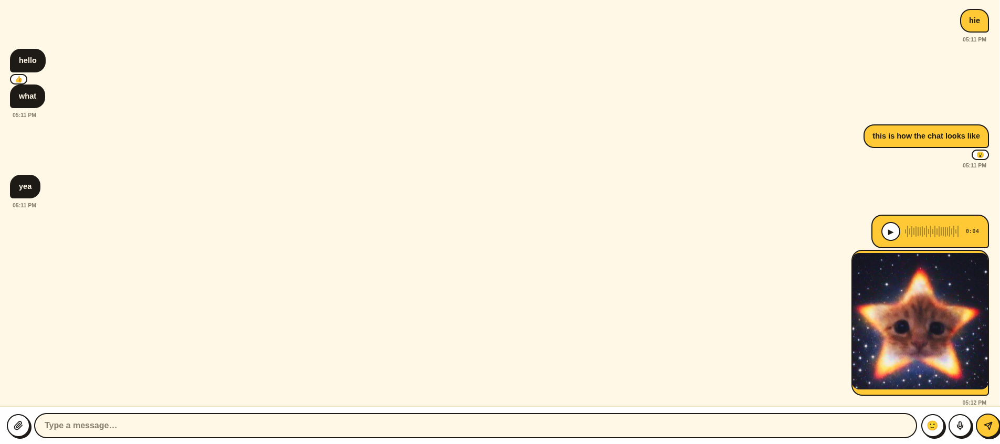
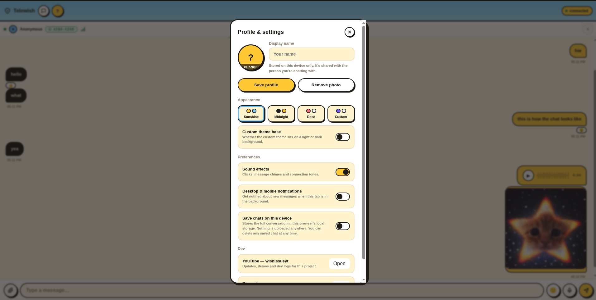

<p align="center">
  
</p>

<h1 align="center">Telewish</h1>

<p align="center"><b>Direct P2P chat. No server sees a single message.</b></p>

<p align="center">
  
  
  
  
</p>

Two people, one direct WebRTC connection, zero backend. Everything is encrypted end-to-end with AES-256 on top of DTLS. Telewish is one HTML file — no build step, no server, no accounts. Just open it and talk.

---

## How it works

Two peers need to swap connection info before a direct link can open. Telewish gives you two ways to do that:

- **Manual / QR code** — one person generates a code (text or QR), the other scans or pastes it in and sends back a reply code. No server involved, ever.
- **Relay server (optional)** — point both sides at a WebSocket relay (`wss://...`) to skip the copy-pasting. It only passes the handshake along, never sees your messages, and the connection goes fully direct once it's done. Bring your own relay, or use one you trust.

The chat itself runs over a direct WebRTC data channel, with messages further locked down using a key derived from a split code + passphrase — shared over two separate channels, so no single leaked message is enough to break in.

---

## Getting started

Open `telewish.html` in a browser. Encryption needs a secure context, so serve it over `https://` or `localhost` — opening it directly as a file may disable encryption in some browsers.

```bash
python3 -m http.server 8000
# then open http://localhost:8000/telewish.html
```

---

## Screenshots

<p align="center">
  <br><br>
  
</p>

---

## Features

<table>
<tr><td><b>Direct P2P messaging</b></td><td>over WebRTC — no server ever sees a message</td></tr>
<tr><td><b>End-to-end encryption</b></td><td>AES-256 layered on top of DTLS</td></tr>
<tr><td><b>Split handshake</b></td><td>code + passphrase, shared over separate channels</td></tr>
<tr><td><b>QR code connect</b></td><td>generate one, scan the other, done</td></tr>
<tr><td><b>Optional relay</b></td><td>bring your own WebSocket relay, or skip it entirely</td></tr>
<tr><td><b>Rich messages</b></td><td>files, images, and voice notes</td></tr>
<tr><td><b>Themes</b></td><td>light, dark, rose, plus a custom option</td></tr>
<tr><td><b>Small touches</b></td><td>sounds, avatars, and other details</td></tr>
</table>

---

## Security notes

This is a personal project and hasn't had a professional security audit — review the code yourself before relying on it for anything sensitive. A relay only ever sees handshake metadata, never chat content, but you're trusting it not to tamper with that handshake; use one you control, or skip it with the manual QR/code flow. Keep the code and passphrase on separate channels, as the app prompts — sending both together defeats the point.

---

## Contributing

Issues and pull requests welcome. Since this is a single HTML file, keep changes self-contained and avoid new dependencies unless there's a good reason.

## License

MIT — see [LICENSE](LICENSE).
